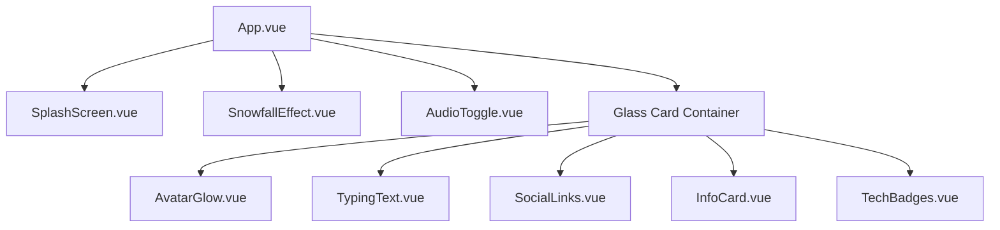

# 🏛️ Portfolio Architecture

Tài liệu này mô tả chi tiết kiến trúc kỹ thuật và luồng dữ liệu của project Portfolio.

## 1. Hệ thống Component (Component Hierarchy)

## 2. Luồng xử lý chính (Core Flows)

### A. Initialization Flow

1. **SplashScreen**: Hiển thị khi người dùng vào trang.
2. **User Interaction**: Người dùng nhấn nút "Enter".
3. **Audio Playback**: `AudioToggle` nhận event và bắt đầu phát nhạc qua YouTube API.
4. **Main Content**: `App.vue` kích hoạt các hiệu ứng (Bokeh, Trail) và hiển thị card chính.

### B. Background Effects Strategy

- **Bokeh Particles**: Sử dụng DOM elements kết hợp CSS Animation để tối ưu hiệu năng render (thay vì Canvas nặng nề cho các vòng tròn mờ).
- **Mouse Trail**: Sử dụng HTML5 Canvas 2D API để vẽ hạt theo tọa độ chuột một cách mượt mà.

## 3. Quản lý trạng thái (State Management)

Project sử dụng **Vue Composition API (ref, reactive)** để quản lý state cục bộ.

- `entered`: Trạng thái đã vào trang hay chưa.
- `isMuted`: Trạng thái bật/tắt âm thanh.

## 4. YouTube API Integration

- API được load động qua thẻ `<script>` trong `onMounted` của `AudioToggle.vue`.
- Sử dụng `videoId` và `playlist` từ `profileConfig` để đảm bảo bài hát có thể lặp lại (loop).
- Player được ẩn hoàn toàn (`opacity: 0`) và chỉ điều khiển qua code.

## 5. Directory Responsibilities

- `src/components/effects/`: Chứa các component phục vụ visual effects.
- `src/config/`: Nơi chứa "Single Source of Truth" cho toàn bộ dữ liệu.
- `src/hooks/`: (Đang phát triển) Tách logic xử lý animation phức tạp.
