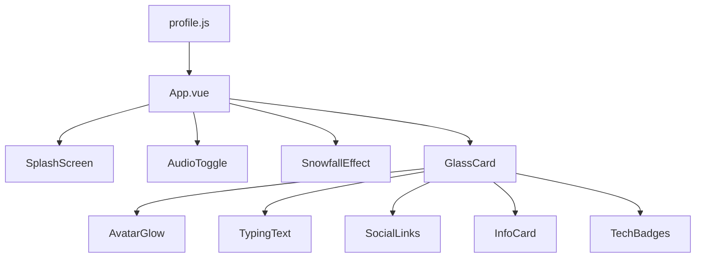

# ❄️ Winter Portfolio - Minh Thuận

[](https://vuejs.org/)
[](https://vitejs.dev/)
[](https://opensource.org/licenses/MIT)

Một portfolio cá nhân phong cách mùa đông tối giản, hiện đại với các hiệu ứng tuyết rơi, aurora bokeh và 3D card tilt. Được xây dựng bởi **Minh Thuận**.

---

## ✨ Tính năng chính

- 🏔️ **Giao diện Mùa đông**: Hiệu ứng Glassmorphism kết hợp tone màu xanh tuyết.
- ❄️ **Snowfall Effect**: Tuyết rơi chân thực theo mật độ tùy chỉnh.
- 🌈 **Aurora Bokeh**: Các đốm sáng lung linh di chuyển mượt mà ở background.
- 🖱️ **Mouse Trail**: Hiệu ứng hạt theo đuổi con trỏ chuột.
- 🎻 **Auto-play Music**: Nhạc nền Winter Lofi tự động phát khi vào trang (thông qua Splash Screen).
- 📱 **Responsive Design**: Tương thích hoàn hảo trên mọi thiết bị.

---

## 🏗️ Kiến trúc tổng quan

Dự án sử dụng **Vue 3 (Composition API)** kết hợp với **Vite** để tối ưu tốc độ build. Dữ liệu được quản lý tập trung tại hệ thống Config.



---

## 🚀 Cài đặt & Chạy project

### Yêu cầu hệ thống

- **Node.js**: >= 18.x
- **npm**: >= 9.x

### Các bước cài đặt

1. Clone repository:
   ```bash
   git clone https://github.com/Mimhthuan113/portfolio.git
   ```
2. Cài đặt dependency:
   ```bash
   npm install
   ```
3. Chạy môi trường phát triển:
   ```bash
   npm run dev
   ```

---

## ⚙️ Cấu hình (Environment)

Dữ liệu của portfolio được cấu hình tập trung tại:
`src/config/profile.js`

Ní có thể thay đổi:

- Biệt danh, các dòng text typing.
- Link mạng xã hội (GitHub, Facebook, Zalo...).
- Danh sách công nghệ (Tech stack).
- YouTube Video ID cho nhạc nền.

---

## 📁 Cấu trúc thư mục

Xem chi tiết tại [FOLDER_STRUCTURE.md](./FOLDER_STRUCTURE.md)

---

## 🤝 Đóng góp

Hướng dẫn đóng góp có tại [CONTRIBUTING.md](./CONTRIBUTING.md)

---

## 📜 Giấy phép

Dự án này được phát hành dưới giấy phép [MIT](./LICENSE).

---

## 🗺️ Roadmap

- [x] Music Auto-play implementation.
- [x] Configuration extraction (Single Source of Truth).
- [ ] Add Project Showcase section.
- [ ] Dark/Light mode toggle.
- [ ] Internationalization (i18n).
